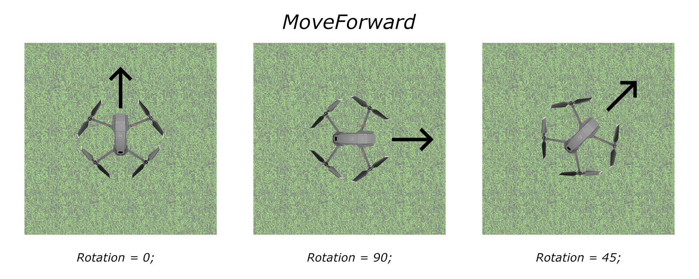

# Oefeningen Unit Tests

Deadline: 02/10/2023 23:59

Deze oefeningen maak je individueel.

## Calculator

Deze opgave maak je met de solution die je kan vinden in de map Calculator.
Je krijgt voor deze oefening al de nodige klasses. In de solution Calculator kan je 2 projecten terug vinden. In het eerste project vindt je de code die we wensen te testen. De Calculator klasse bevat een aantal methodes die we wensen te testen.
In het andere project vindt je reeds de CalculatorTests klasse. Hierin mag je alle testen schrijven. Voor jullie zijn in dit project reeds de NUnint packages voorzien en een referentie naar het Calculator project.

Schrijf testen voor alle methodes in de calculator klasse.
Gebruik hiervoor de geziene technieken in de les.
Let zeker op volgende zaken:

- Naamgeving
- Test voldoende cases
- AAA-techniek

## Drankautomaat

In de folder FrisdrankAutomaat vindt je een project die een frisdrankautomaat simuleert.
In de applicatie wordt de automaat telkens random opgevuld. Nadien kan je 3 basis acties uitvoeren:

- Munten in werpen
- Een item aankopen
- Geld terug vragen

Voorzie een test project met alle nodige zaken.
Schrijf alle nodige/nuttige tests voor de publieke properties en methodes in de klasse VendingMachine.
Schrijf minstens volgende tests:

- Er kunnen dranken aan de automaat toegevoegd worden
  - De methode FillRandomly moet je niet testen. Deze maakt gebruik van random waarden, dit kunnen we nu nog niet testen.
- Munten inwerpen.
- Terug krijgen van geld wanneer dit gevraagd wordt.
- Aankopen van een drankje. Voorzie ook tests wanneer je in exception states komt.

## DroneSimulator

In de folder DroneSimulator vindt je een project die een drone met een remote simuleert.

### Applicatie/klassen

De applicatie maakt gebruik van 2 klassen. Enerzijds hebben we een klasse Drone. Anderzijds is er een klasse Remote.

#### De klasse Drone

In de klasse drone hou je de huidige status van de drone bij.
De klasse Drone bestaat uit onderstaande properties:

- Height (double)
- Latitude (double, _of ook de X-positie_)
- Longitude (double, _of ook de Y-positie_)
- Rotation (int, _in welke richting de drone "kijkt"_)
- MotorOn (boolean)

#### De klasse Remote

De klasse Remote heeft een private reference/member naar de Drone waarvoor de Remote gemaakt is. Deze is private en dus niet publiek toegankelijk via properties. Stel de Drone van een Remote in, in de constructor.

Een remote heeft een aantal publieke methodes:

- `void TakeOff()`
- `void MoveForward()`
- `void MoveLeft()`
- `void MoveRight()`
- `void MoveBack()`
- `void MoveDown()`
- `void MoveUp()`
- `void Rotate(int degrees)`
- `void Land()`

#### TakeOff & Land

Een drone kan niet bewegen alvorens de motor aan staat. Met de methode TakeOff zorg je ervoor dat de drone start en zich naar 1 meter hoogte begeeft.
De methode Land kan je gebruiken om de motor uit te zetten en de drone terug te brengen naar de grond.

#### MoveForward, MoveBack, MoveLeft, MoveRight, MoveUp, MoveDown

Met de move commando's kan je de drone laten bewegen. Deze commando's worden steeds uitgevoerd ten opzichte van de huidige positie en rotatie.
MoveForward is dus bij een rotatie van 0 graden een beweging ten opzichte van de Latitude. Bij een rotatie van 90 graden is dit een beweging ten opzichte van de Longitude.

De drone beweegt standaard in stappen van 10 cm. Wanneer de Drone dus 45 geroteerd is, is dit een beweging van  cm, zowel in latitude als in longitude. Beperk je in begin tot bewegingen van 90 graden. Nadien kan je geavanceerdere mogelijkheden implementeren

Tot slot mag een drone omwille van connectiviteit nooit meer dan 25 meter van zijn startpunt komen. De afstand tot een bepaald punt in een 3D wereld kan je berekenen door de vierkantswortel te nemen van de som van de kwadraten van elke dimensie. Dus de afstand is gelijk aan 

#### Rotate

De parameter die je meegeeft aan de rotatie methode is steeds het aantal graden dat toegevoegd moet worden. Een positieve rotatie is steeds met de wijzers van de klok.

### Testen

Voorzie een correct testproject me alle nodige NuGet-packages en de referentie naar het te testen project.

Test minimaal onderstaande zaken:

- Een drone kan enkel bestuurd worden wanneer hij gestart is.
- Een drone kan nooit lager dan 1 meter vliegen
- De move methodes houden rekening met de huidige rotatie
- De afstand kan nooit meer dan 25 meter zijn ten opzichte van de startlocatie.

### Uitbreiding

Indien je klaar bent kan je proberen onderstaande uitbreidingen aan te brengen aan de bestaande code als ook de nodige tests.

- Bereken de totale afstand die de drone heeft afgelegd. Wanneer de totale afstand meer dan 100 meter is, zal de drone automatisch landen.
- Hou de gevlogen route bij van TakeOff tot het landen.
